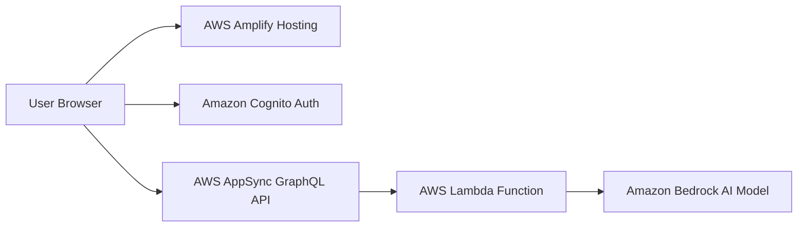

### ✨ Features

- **Secure User Authentication:** Managed by Amazon Cognito, supporting user registration, sign-in, and account recovery.
- **AI-Powered Itinerary Generation:** Uses the Claude 3 Sonnet model via Amazon Bedrock to create instant travel recommendations.
- **Serverless Architecture:** Built entirely without managing physical servers, utilizing AWS Lambda and AWS AppSync.
- **Real-time Interaction:** Fetches and displays AI-generated results instantly based on user interests.
- **Scalable Frontend:** Hosted on AWS Amplify for high availability and performance.

---

### 💻 Tech Stack Section

|Category|Technology|Description|
|:--|:--|:--|
|**Frontend**|React.js (TypeScript)|A modern UI library for building the web interface.|
|**Authentication**|Amazon Cognito|Handles secure user registration and sign-in processes.|
|**API**|AWS AppSync|A managed GraphQL service to handle data requests.|
|**Backend**|AWS Lambda|Serverless compute service used to run backend logic.|
|**AI Model**|Claude 3 Sonnet|A generative AI model via Amazon Bedrock for planning itineraries.|
|**DevOps**|AWS Amplify|Handles deployment, CI/CD, and serverless resource management.|

---

### 🏗️ Architecture Overview

The application uses **AWS Amplify** for frontend deployment and **AWS AppSync** as a GraphQL interface. When a user submits interests, a **Lambda function** constructs a prompt and sends an HTTP POST request to the **Claude 3 Sonnet** model in **Amazon Bedrock**. **Amazon Cognito** secures the entire process by managing user sessions and verification emails.

---

### 📖 Usage

1. **Sign Up:** Create an account and verify it using the unique code sent to your email.
2. **Enter Interests:** Type your travel interests (e.g., "sea, swimming, history") into the search bar.
3. **Generate:** Click the submit button to trigger the AI generation.
4. **View Results:** The application will display a customized destination suggestion instantly.

---